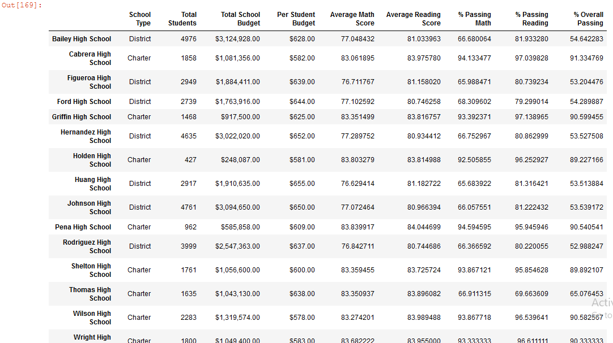
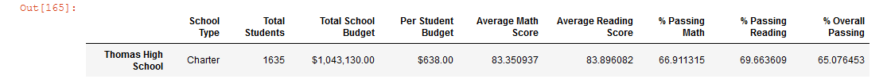
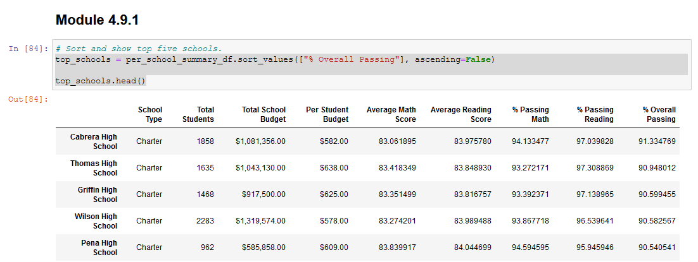

# Module 4 Challenge- _Deliverable 3_

This written analysis contains three sections:

**1. Overview of the school district analysis**

**2. Results**

**3. Summary**
 
## 1. Overview of the school district analysis

The aim of the analysis was to provide actionable insights to Maria, who is the chief data-scientist for the city school district. This analysis intends to helps aggregate and showcase multiple attributes related to funding and performance of each school in the district and would help the school board make more strategic decisions on funding. 

The school board has notfied Maria and her team of possible academic dishonesty on math and reading scores of Thomas High School ninth-graders. The analysis helps to correct the error by making the affected scores null-and-void and describing how the changes affected the overall analysis.

The analysis involved looking at over **39,000** student records at over **15** district and charter schools. The analysis was done in Pyhton using Pandas and NumPy in Jupyter Notebook

## 2. Results

### **a. How is the district summary affected?**

Since the scores of ninth-graders for THS were declared null-and-void, the district summary saw **decline** in *Average Math Score* and **decline** in *% Passing in Math, Reading and Overall* The image below compares the original scenario with the revised scenario. For eg. in the Top image the Average Math score was 79.0 which was brought down to 78.9 in the bottom image with the changes for THS scores. 

*For this analysis, some changes in the formatting of the module was made to make the comparison valid as initially the Module had the rounding to be formatted to zero decimal place while the Challenge had it rounded to a single decimal place. Changes were made in the Module to ensure both are compared with one decimal place.*

*a. Original District Summary*

*b. Revised District Summary*

### **b. How is the school summary affected?**

The school summary was afftecd **only for Thomas High School** since there were **no other changes in the dataset for the other schools.** In the revised scenario, there was **significant decline** *Passing %* across math, reading and overall scenarios driven by the fact that the ninth-graders were not considered. The images below show that the passing percentages went down from 90% levels to 65% approximately , almost a 25% decline in absolute terms.

However, on substituting the scores of the rest of the students (10th-12th grades) from Thomas High School to the overall score, we see the decline in the *Passing %* has been corrected to previous levels. This scenario is shown in the thrid image below.

*For this analysis, replacing the scores of the 9th Graders from THS with historical scores or comparative scores from other schools might also have been a solution which might provided us with a different result*

*a. Original School Summary*

*b. Revised School Summary*

*c. Revised School Summary after substitution*

### **c. How does replacing the ninth graders’ math and reading scores affect Thomas High School’s performance relative to the other schools?**

As shared above, in the revised scenario, there was **significant decline** *Passing %* across math, reading and overall scenarios driven by the fact that the ninth-graders were not considered. The images below show that the passing percentages went down from 90% levels to 65% approximately , almost a 25% decline in absolute terms. However, on substituting the scores of the 10th-12th graders for a better comaprison, the scores are corrected again to a prior levels. *(Images a, b, c)*

From ranking standpoint, with the last correction of substituting the 9th grade scores with ones from 10-12th grades, Thomas High School retains its **Second** position ranking as one of the best performing schools in the district even thought he Passing percentages have changed a little. *(Images d,e)*

*a. Original School Summary*

*b. Revised School Summary*

*c. Revised School Summary after Subsitution*
*
*d. Ranked Original School Summary*

*e. Ranked Revised School Summary*

### **d. How does replacing the ninth-grade scores affect the following:**

#### *i) Math and reading scores by grade:*

The only change in the two scenarios is the change in 9th grade students for Thomas high school has been replaced with `NaNs` as it could be invalid.

*Although the Challenge instructed the Passing % to be replaced, the individual scores were not changed which could show a different result.*

*a. Math Grades Original* 

*b. Reading Grades Original*

*c. Math Grades Revised*

*d. Reading Grades Revised*

#### *ii) Scores by school spending*

The spending of each school or the spending per student did not change in this analysis as the number of students in both cases were the **same**. Although there was minimal change in scores for Thomas High School, there wasn't major difference in this criteria.

*a. Scores and Spending Original* 

*b. Scores and Spending Revised*

#### *iii) Scores by school size*

Similar to the above analysis, since the number of students laregly stayesd the same, there wasn't any major change in this criteria and both sceraios produced **very simialr results.**

#### *iv) Scores by school type*

Similar to the above analysis, since the number of students laregly stayesd the same, there wasn't any major change in this criteria and both sceraios produced **very simialr results.**

## 3. Summary

The four major changes in the updated school analysis after the reading and math scores for the ninth grade at Thomas High School (THS) have been replaced with `NaNs` are capture in the below images,

*a. Original School Summary*

*b. Revised School Summary*

*c. Revised School Summary after Subsitution*
*

### a. Overall Passing Percentage :

There was **significant decline** *Passing %* across overall scenario driven by the fact that the ninth-graders were not considered. The images below show that the passing percentages went down from 90% levels to 65% approximately , almost a 25% decline in absolute terms. 

However, on substituting the scores of the 10th-12th graders for a better comaprison, the passing percentage is corrected to **90.63%** which is a little less than the original **90.94%**

### b. % Passing Reading :

There was **significant decline** *Passing %* across reading driven by the fact that the ninth-graders were not considered. The images below show that the passing percentages went down from 97% levels to 69% approximately , almost a 27% decline in absolute terms. 

However, on substituting the scores of the 10th-12th graders for a better comaprison, the passing percentage is corrected to **97.01%** which is a little less than the original **97.31%**

### c. % Passing Math :

There was **significant decline** *Passing %* across math driven by the fact that the ninth-graders were not considered. The images below show that the passing percentages went down from 93% levels to 67% approximately , almost a 26% decline in absolute terms. 

However, on substituting the scores of the 10th-12th graders for a better comaprison, the passing percentage is corrected to **93.18%** which is a little less than the original **93.27%**

### d. Math and Reading scores :

There was a **decline** in Average Math scores as it changed from **84.42** to **83.35** while the Average reading scores **increased** from 83.84 to **83.90**